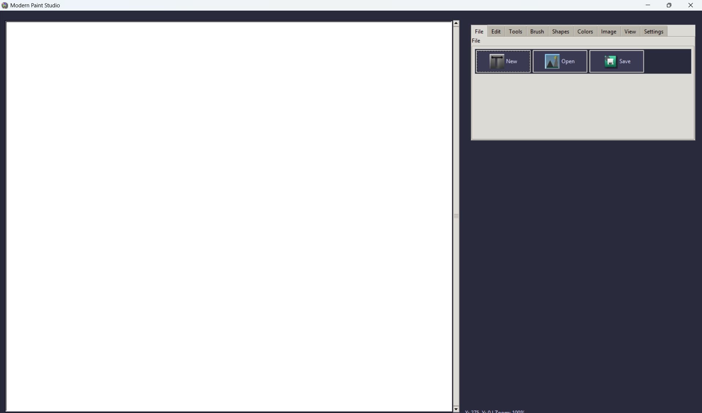
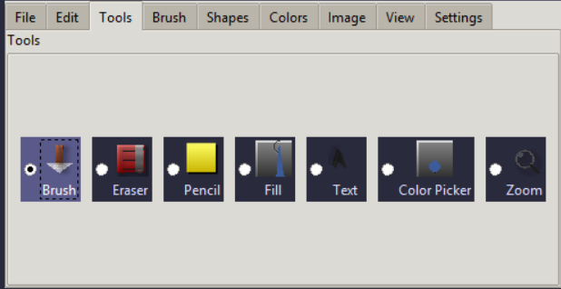
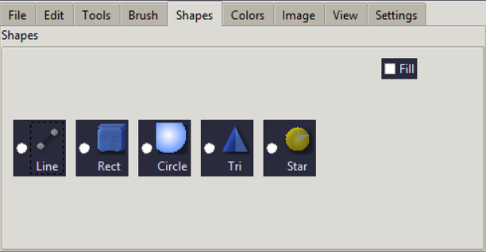
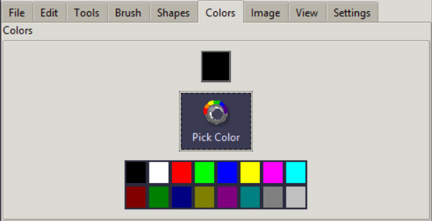
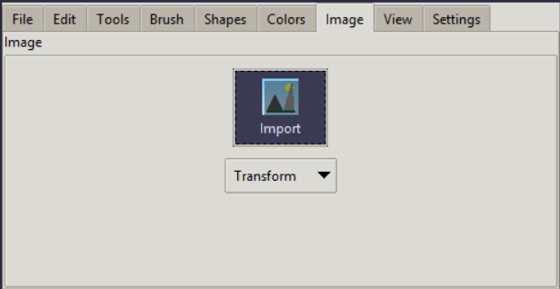

# Python Paint App

A simple yet feature-rich desktop painting application built with Python's Tkinter and the Pillow library. This application provides a classic paint experience with modern UI elements, customizable themes, and essential drawing tools.

## ✨ Features

* **Basic Drawing Tools:**
    * Brush (round, square, airbrush types)
    * Pencil
    * Eraser
    * Color Fill (Bucket tool)
* **Shape Drawing:**
    * Lines
    * Rectangles
    * Circles/Ovals
    * Triangles
    * Stars (5-point)
    * Option to fill shapes with color.
* **Color Management:**
    * Color picker dialog.
    * Pre-defined color palette for quick selection.
    * Display of current drawing color.
* **Image Manipulation:**
    * Import existing images onto the canvas.
    * Crop selected areas.
    * Rotate (90°, 180°, 270°).
    * Flip (horizontal, vertical).
* **Text Tool:** Add text to the canvas with customizable font size.
* **Selection Tool:** Rectangle selection for cropping.
* **Zoom Functionality:** Zoom in/out using mouse wheel or predefined levels.
* **View Options:**
    * Toggle gridlines for precise drawing.
    * Toggle rulers for measurement.
* **Undo/Redo History:** Unlimited undo and redo functionality.
* **File Operations:**
    * New canvas.
    * Save canvas as PNG or JPG.
    * Load existing images.
* **Customizable Settings:**
    * Light and Dark themes.
    * Adjustable canvas background color.
    * Configurable default brush size.
    * Settings persistence (saves theme, brush size, grid/ruler visibility).
* **Responsive UI:** Adapts to window resizing.
* **Status Bar:** Provides real-time feedback on cursor coordinates, selection size, zoom level, and tool messages.

## 📸 Screenshots




_A clear view of the Universal Downloader's main interface with the dark theme enabled._

---




_Overview of the various drawing tools available in the app._

---




_Demonstration of the different shapes that can be drawn, including the fill option._

---




_The color selection interface, showing the color picker and palette._

---




_The section for importing and transforming images on the canvas._

## 🚀 Installation

1.  **Clone the repository:**
    ```bash
    git clone [https://github.com/your-username/python-paint-app.git](https://github.com/your-username/python-paint-app.git)
    cd python-paint-app
    ```

2.  **Create a virtual environment (recommended):**
    ```bash
    python -m venv venv
    # On Windows:
    .\venv\Scripts\activate
    # On macOS/Linux:
    source venv/bin/activate
    ```

3.  **Install dependencies:**
    ```bash
    pip install Pillow
    ```

4.  **Generate Icons:**
    This app uses custom icons. Run the `icon_generate.py` script to create the `icons` directory and populate it with necessary image files.
    ```bash
    python icon_generate.py
    ```

## 🎨 Usage

1.  **Run the application:**
    ```bash
    python main.py
    ```

2.  **Explore the Interface:**
    * The top section contains toolbars for **File**, **Edit**, **Tools**, **Brush Options**, **Shapes**, **Colors**, **Image**, **View**, and **Settings**.
    * Click on tool buttons to select drawing modes (Brush, Eraser, Pencil, Fill, Text, Color Picker, Zoom, Selection).
    * Choose shapes (Line, Rectangle, Circle, Triangle, Star) from the "Shapes" section.
    * Adjust brush size using the slider and brush type using the dropdown.
    * Select colors from the palette or use the "Pick Color" button.
    * Use "Import" to load images, "Crop" to crop selections, and "Transform" for rotations/flips.
    * In the "View" section, toggle gridlines and rulers, and adjust zoom.
    * Under "Settings", switch themes or change canvas properties.
    * The bottom status bar provides real-time information.

3.  **Drawing:**
    * Select a tool/shape and click/drag on the canvas.
    * For text, select the "Text" tool, click on the canvas, and enter your text in the dialog.
    * Use `Ctrl+Z` for Undo and `Ctrl+Y` for Redo (or the buttons in the "Edit" section).

## ⚙️ Customization

* **Themes:** Switch between "Light Theme" and "Dark Theme" from the "Settings" section.
* **Canvas Background:** Change the canvas background color via the "Canvas Color" button in "Settings".
* **Default Brush Size:** The application remembers your last used brush size.
* **Gridlines & Rulers:** Toggle their visibility from the "View" section.
* **`paint_settings.json`:** The application saves user preferences (theme, default brush size, canvas background, grid/ruler visibility) in a `paint_settings.json` file in the application directory. You can manually edit this file, but it's generally recommended to use the in-app settings.

## 🤝 Contributing

Contributions are welcome! If you have suggestions for improvements, new features, or bug fixes, please feel free to:

1.  Fork the repository.
2.  Create a new branch (`git checkout -b feature/YourFeature`).
3.  Make your changes.
4.  Commit your changes (`git commit -m 'Add new feature'`).
5.  Push to the branch (`git push origin feature/YourFeature`).
6.  Open a Pull Request.

## 📄 License

This project is licensed under the MIT License - see the `LICENSE` file for details. *(Note: You might need to create a `LICENSE` file in your repository if you haven't already.)*

## 🙏 Acknowledgments

* [Tkinter](https://docs.python.org/3/library/tkinter.html) - The standard Python interface to the Tcl/Tk GUI toolkit.
* [Pillow (PIL Fork)](https://python-pillow.org/) - The friendly PIL fork for image manipulation.
* [yt-dlp](https://github.com/yt-dlp/yt-dlp) - (If you integrate the downloader core, otherwise remove this) For robust video/audio downloading.
* [requests](https://requests.readthedocs.io/en/latest/) - (If you integrate the downloader core, otherwise remove this) For handling HTTP requests.
